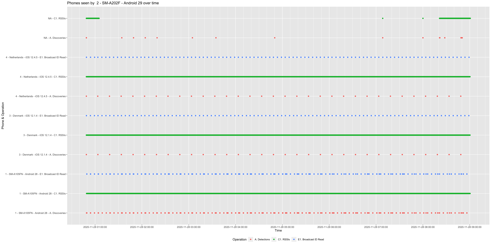
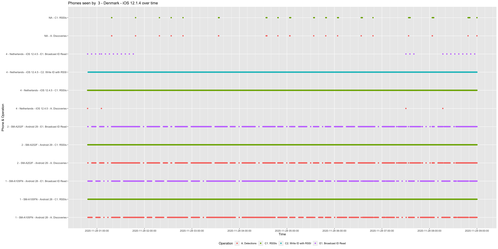
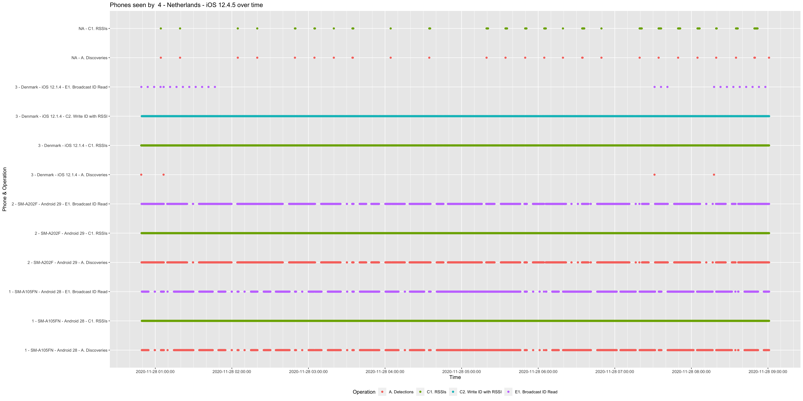
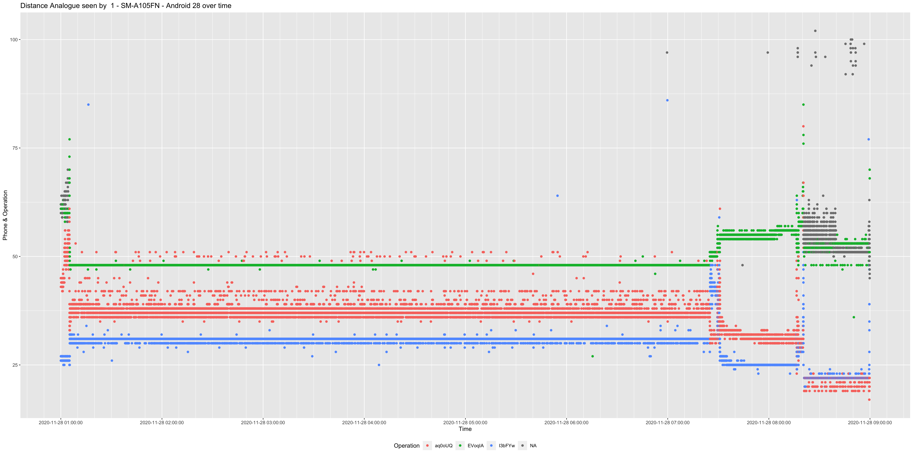
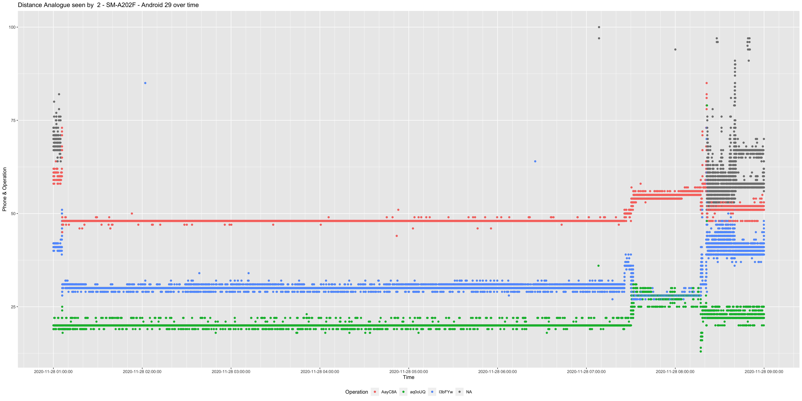
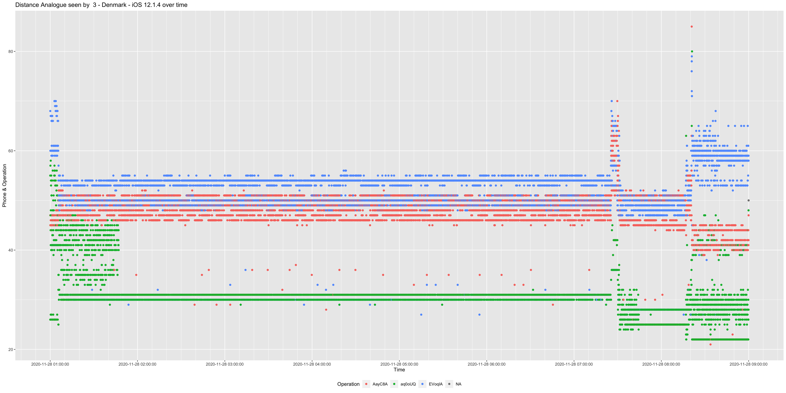
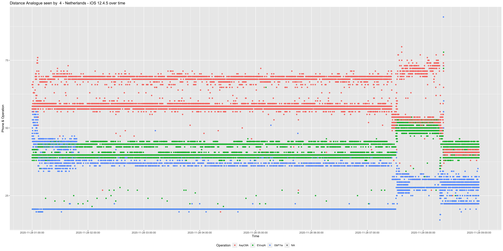
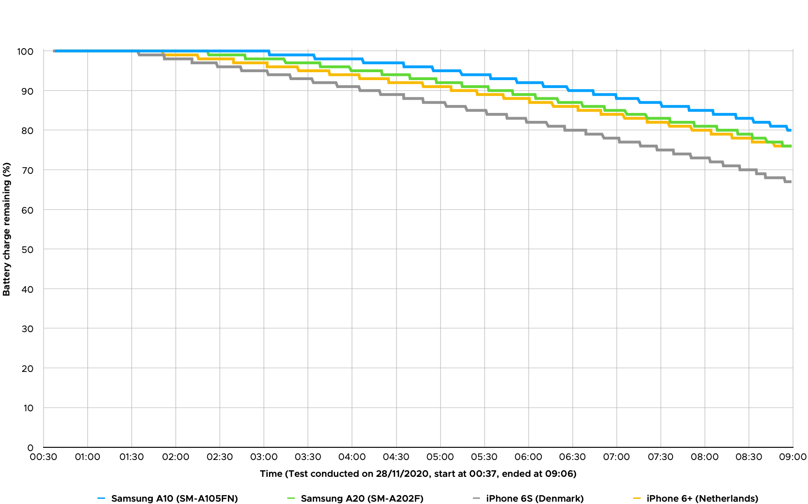

# 2020-11-28

A formal test on 4 phones (2 iOS, 2 Android) carried out on 27 Nov 2020
by Adam Fowler of the Herald Protocol development team as a pre-release
test for Herald v1.1.0. These are the same 4 phones used for all Herald 
minor version and beta version performance regression tests.

Herald v1.1.0 made improvements in connection stability and reliability between
iOS and Android. Additional logic was also added to Android in order
to limit the number of Apple devices Android attempts to connect to.
These are non-iPhone devices. This means less communication and less 
'interference' with the protocol's work communicating with devices.

This resulted in only a single 30 second window being missed between
the 4 phones in the test during a full 8 hour period. This also meant
a longevity score of 100%.

The results are impressive given they are deliberately ran on known
problem phones. A Samsung A10 on Android 29, Samsung A20 on Android 28,
and two iPhones on iOS 12.1.4 and 12.4.5.

Completeness has not been recalculated, but is too likely to be higher.
We have used the current known value for this until a full 10 device
test can be ran.

**Updated 1 Dec 2020**: Added results breakdown and images, below.

**Updated 11 Jan 2021**: Added battery level image, below.

## Results

|Measure|Result|Notes|
|---|---|---|
|Overall Efficacy|<b>41.37%</b>|<b>Effective</b> (UK MAX 46.57%)|
|<i>Probability of detection</i>|94.37%|Formal RISK detection|
|Phone Detection|100%|Includes iOS in the background|
|Continuity|99.991%|Full continuity|
|Completeness RT1|98.36%||
|Completeness RT2|TBD|Not yet calculated from data|
|Completeness CE|95.95%||
|Accuracy|95.95%|RSSI accuracy|
|Longevity|100.00%|8 hour test|
|Mean time between readings|&lt;=4.39s||
|Country|UK||
|Have BLE Phones|72.53%|OFCOM reports|
|Hardware Support|98.19%|BBC data|
|Software/OS Support|98.00%|BBC data|
|Overall Pspec|69.79%||
|<i>Pspec squared</i>|48.71%||

## Phones tested

|PhoneId|Phone Make and Model|OS and version|Known issues|
|---|---|---|---|
|1|Samsung A10 (SM-A105FN)|Android 28|A10s knowingly rotate their BLE MAC address with every request. Herald uses an ephemeral ID that rotates every 15 minutes as a performance improvement|
|2|Samsung A20 (SM-A202F)|Android 29|Same issue as A10, above|
|3|iPhone 6S|iOS 12.1.4|(phone name is Denmark)|
|4|iPhone 6+|iOS 12.4.5|(phone name is Netherlands)|

## Fair Efficacy Stats Summary

|Phones|Max Pairs|Pairs Detected|Detection Percent|Max 30 second windows|30 second windows achieved|Missed windows percentage|Longevity change over 8 hours|
|4|12|12|100%|11520|11519|0.00868%|0%|

## Phone detection and distance estimation reports

The below 4 charts show discoveries, ID (data payload) reads, and RSSI (distance estimation) readings as individual dots.

The below chart shows RSSI variation over time. In a formal 8 hour test these will mostly be static.

The below chart shows battery charge remaining over time.

